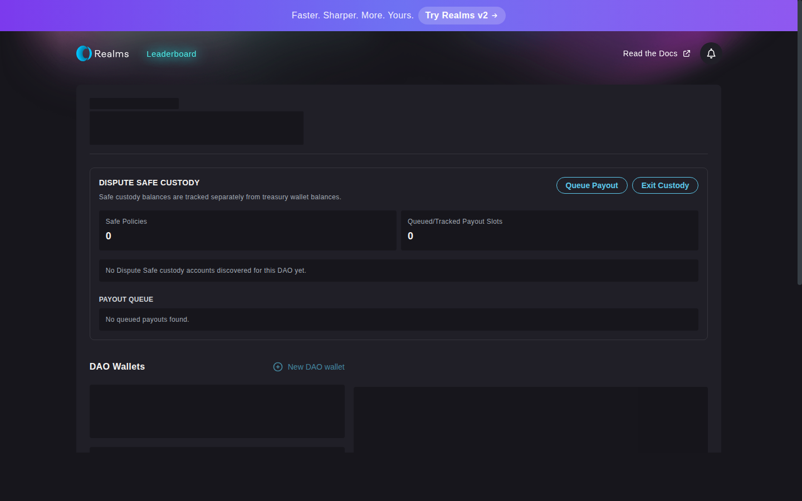
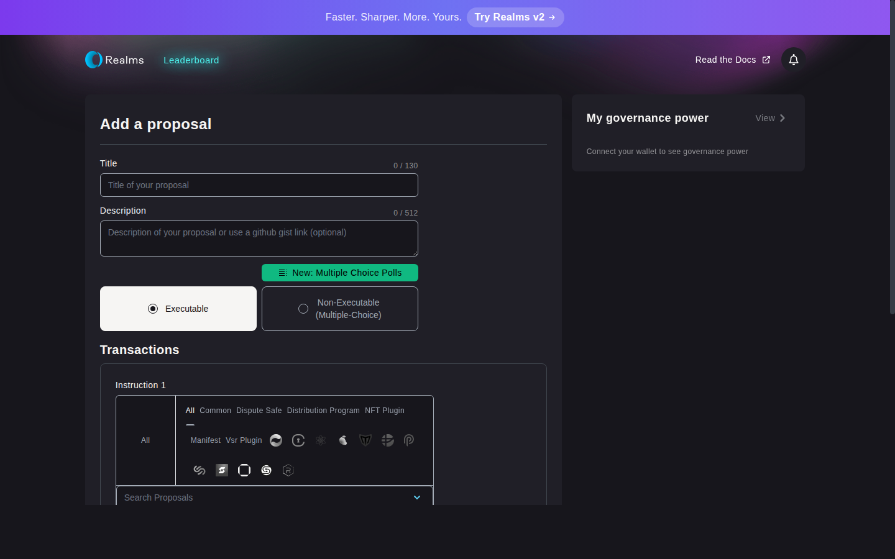

# Realms Arbitration Layer

**A dispute resolution system for Realms DAOs on Solana**

## What this project does

Adds a safety layer to DAO treasury payouts. Instead of payouts executing immediately after approval, they enter a dispute window where community members can challenge suspicious transactions before funds leave the treasury.

**The problem:** DAOs need a way to catch malicious or mistaken treasury proposals before money is lost.

**The solution:** A challenge period with economic incentives (bonds) and neutral arbitration (AI or human resolvers).

## What's included

- **Safe Treasury Program** — on-chain Solana program managing payout queues, challenges, and rulings
- **Realms UI Integration** — treasury management screens and proposal instructions built into the Realms interface
- **AI + Human Arbitration** — automated and manual dispute resolution workflows

## How it works

### 1. Queue a payout
A DAO votes to send funds (or even NFTs). Instead of immediate execution, the payout enters a queue with a dispute window (e.g., 24 hours).

That is made possible because **the DAO's treasury is held in a safe treasury vault** rather than the ordinary treasury vault of Realms DAOs. The safe treasury receives instructions from DAO governance, but has a time period open for requesting arbitration if the transaction does not respect the **DAO's Constitution**. DAOs wanting to adopt this safety mechanism must opt-in / migrate their treasury.

### 2. Challenge window
Anyone holding the required token can challenge the payout by posting a bond. This freezes the payout and triggers arbitration.

### 3. Arbitration
A designated resolver (which is a DAO of AI agents or human arbitrators, onboarding arbitral bodies to web3) reviews the challenge and issues a ruling: **Allow** or **Deny**.

### 4. Resolution
- **Allow** → Payout executes, challenger loses bond
- **Deny** → Payout cancelled, challenger gets bond back

## UI Screenshots

Screenshots captured by automated browser agent running against local test network. Better quality and demo to be updated.

### Treasury page with Dispute Safe controls



The treasury screen shows:
- Safe Policy status (dispute window, bond requirements)
- Payout queue with challenge status
- Action buttons: Queue Payout, Exit Custody

### Proposal creation with Dispute Safe instructions



DAOs can create proposals using new instruction types:
1. **MigrateToSafe** — set up dispute policy (bond amount, dispute window, resolver address)
2. **QueuePayout** — add a payout to the queue (SOL or SPL tokens)
3. **ChallengePayout** — challenge a queued payout
4. **ExitFromCustody** — withdraw funds from safe custody

## What's working

✅ **On-chain program** — Safe Treasury program builds and deploys  
✅ **Localnet demo** — Full bootstrap script creates test DAOs and payout fixtures  
✅ **UI integration** — Instructions render in Realms proposal interface  
✅ **Treasury screens** — Dispute Safe custody panel displays in treasury view  

## What's in progress

⏳ **End-to-end flow** — Full challenge → ruling → release cycle in browser (currently script-based)
⏳ **Production readiness**

## Feature Categories Successfully Tested

| Repository | Core Feature Categories | Test Types | Status |
|-----------|------------------------|------------|---------|
| **arbitration-layer** (Safe Treasury) | • Policy initialization & updates<br>• Treasury registration & management<br>• Native/SPL vault operations<br>• Payout queue/release lifecycle<br>• Challenge bond mechanisms<br>• Ruling record/appeal/finalize<br>• Governance proposal integration | • Unit tests (state enums)<br>• On-chain program tests<br>• Formal verification (Certora)<br>• Localnet script validation<br>• Integration flow tests | ✅ Working |
| **ai-arbitration-dao** | • CLI command orchestration<br>• Agent runtime & health monitoring<br>• Proposal creation/voting/execution<br>• Resolver binding & authorization<br>• Ruling payload validation<br>• Governance adapter integration<br>• Observability & logging<br>• Worker environment reconciliation | • Unit tests (18 test modules)<br>• Integration tests<br>• CLI contract validation<br>• Runtime environment tests<br>• Secret redaction tests<br>• JSON output validation | ✅ Working |
| **human-arbitration-dao** | • Realms DAO bootstrapping<br>• Role-based access control<br>• CLI interface for operations<br>• Web voting interface<br>• Case management workflows<br>• Treasury operations | • CLI integration tests<br>• Web interface tests<br>• Role model validation<br>• Bootstrap deployment tests | ✅ Working |
| **governance-ui** | • DisputeSafe instruction registration<br>• Treasury account store management<br>• Transaction state handling<br>• Router history tracking<br>• Delegator selection<br>• Vote stake registry<br>• Proposal creation UI | • UI component tests<br>• Store state tests<br>• Instruction registration tests<br>• SSR page rendering (all routes) | ✅ Working |

### Test Coverage Summary

- **Total Test Files**: 60+ across all repositories
- **Core Flows Validated**: Treasury operations, Arbitration workflows, Governance integration, DAO bootstrapping

## Test evidence across workstreams

- `arbitration-layer/`: on-chain program tests, localnet script validation, and formal verification WIP artifacts under `certora/`.
- `governance-ui/`: UI and integration-oriented test coverage for Realms arbitration surface changes.
- `ai-arbitration-dao/`: unit/integration/e2e scaffolding and command-level validation paths for agent runtime flows.
- `human-arbitration-dao/`: CLI modules with test coverage and executable scripts for arbitration operator workflows.

## Realms prize alignment

1. **Authority-First Orgs (strong onchain authority)** – DAO Constitution and policy enforcement plus AI/Human arbitration DAOs demonstrate onchain authority and escalation paths for disputes.
2. **Governance Builders (tooling + governance systems)** – Safe Treasury program to govern executable payout challenge flows for Realms DAOs.
3. **Realms Extensions (integrations/plugins)** – governance-ui modifications slot arbitration features directly into the existing Realms surface (in v1, but happy to integrate in v2).

## Repo structure

- `arbitration-layer`: Core Realms Arbitration Layer workstream (program + deployment tooling WIP).
- `governance-ui`: Realms UI v1 fork/extension surface for arbitration support.
- `ai-arbitration-dao`: DAO scripts/runtime scaffolding for AI arbitrators.
- `human-arbitration-dao`: Human arbitrator DAO tooling (CLI).

## Program IDs

| Program | ID |
|---|---|
| `safe-treasury` | `9yMpZraAc4pFvg4DXTT3rhvUvdh2xGQUdiNLQ1bwEhCD` |
| `spl-governance` (mainnet binary) | `GovER5Lthms3bLBqWub97yVrMmEogzX7xNjdXpPPCVZw` |

## Demo quick commands

```bash
# Terminal 1 — start validator (leave running)
bash arbitration-layer/scripts/localnet/start-local-validator.sh

# Terminal 2 — bootstrap + seed + demo
bash demo-hackathon.sh
```

Instead of running the above, you can check a sample output in [demo-hackathon-output.txt](./demo-hackathon-output.txt).

# Disclaimer

This is an early prototype and should not be placed into production without thorough vetting/testing/auditing.